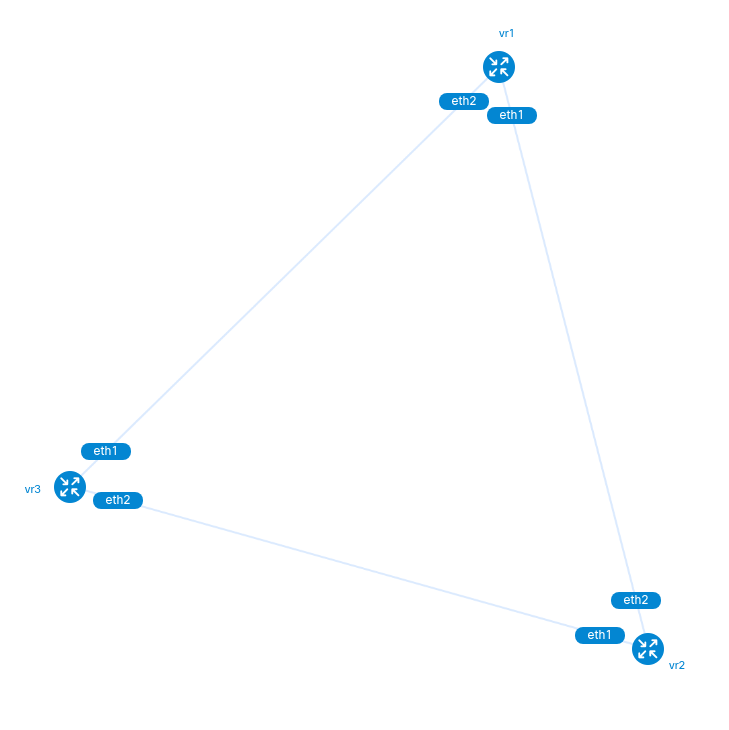

vrnetlab - VR Network Lab
-------------------------

This repository is a fork of the project [vrnetlab/vrnetlab](https://github.com/vrnetlab/vrnetlab).
The fork has been created specifically for testing purposes.
You need to build your own containers for the network devices.

It is tested with:

 * Cisco CSR1000v 16.12.05 - csr1000v-universalk9.16.12.05-serial.qcow2
 * Cisco CSR1000v 17.03.04a - csr1000v-universalk9.17.03.04a-serial.qcow2
 * Cisco CSR1000v 17.03.05 - csr1000v-universalk9.17.03.05-serial.qcow2
 * Cisco CSR1000v 17.03.07 - csr1000v-universalk9.17.03.07-serial.qcow2
 * Juniper VMX 18.2R1.9 - vmx-bundle-18.2R1.9.tgz

The documentation provided in this fork only explains the parts that have been changed in any way from the upstream project. To get a general overview of the vrnetlab project itself, consider reading the docs of the upstream repo.

    

Lab01 - [Python NAPALM + Cisco](https://github.com/bvilajol/vrnetlab/blob/master/lab/01_napalm_cisco)
-------------------------
* Simple eBGP scenario formed by three Cisco CSR1000v nodes.
* Python NAPALM is used to configure and validate the laboratory.

        *** Exercice 1 started. Logging to logging.log
        *** Configuring interfaces
        *** Overall IP connectivity result is [True]
        *** Configuring EBGP
        *** Logging detailed BGP Adjacencies from NAPALM getters
        *** DONE. Peering RESULT is [True, True, True]

Lab 03 - [ANSIBLE + Cisco](https://github.com/bvilajol/vrnetlab/blob/master/lab/03_ansible_cisco)
-------------------------
* Simple eBGP build and validated using Ansible.
* Modules napalm_get_facts and napalm_validate are used as well.
* Simple and unified reporting using Jinja templating.

        Hostname: 172.17.0.2
        -----------------
        Neighbor:           192.168.1.2
        Enabled:            True
        Neighbor_UP:        True
        Accepted Prefixes:  0
        Received Prefixes:  0
        Sent Prefixes:      0

        Neighbor:           192.168.3.1
        Enabled:            True
        Neighbor_UP:        True
        Accepted Prefixes:  0
        Received Prefixes:  0
        Sent Prefixes:      0

        Hostname: 172.17.0.3
        -----------------
        Neighbor:           192.168.1.1
        Enabled:            True
        Neighbor_UP:        True
        Accepted Prefixes:  0
        Received Prefixes:  0
        Sent Prefixes:      0

        Neighbor:           192.168.2.2
        Enabled:            True
        Neighbor_UP:        True
        Accepted Prefixes:  0
        Received Prefixes:  0
        Sent Prefixes:      0

        Hostname: 172.17.0.4
        -----------------
        Neighbor:           192.168.2.1
        Enabled:            True
        Neighbor_UP:        True
        Accepted Prefixes:  0
        Received Prefixes:  0
        Sent Prefixes:      0

        Neighbor:           192.168.3.2
        Enabled:            True
        Neighbor_UP:        True
        Accepted Prefixes:  0
        Received Prefixes:  0
        Sent Prefixes:      0
