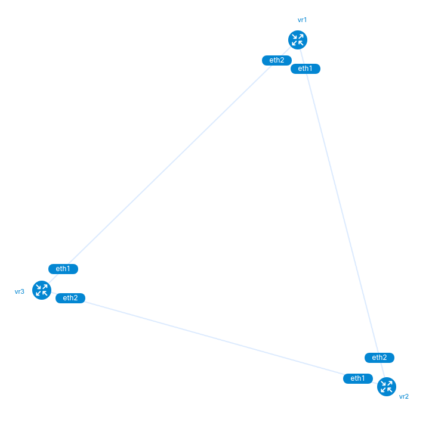

# Lab 01 - Introduction to NAPALM

* You need to build your own containers for the network devices.
* Created simple eBGP scenario of three Cisco CSR1000v nodes.
* Pyton NAPALM is used to configure and validate the scenario.

    

## 0. Build the image

* Download csr1000v-universalk9.17.03.05-serial.qcow2 or any other tested version
* Follow the instructions on [vrnetlab](https://github.com/vrnetlab/vrnetlab/blob/master/csr/README.md)
* vr-xcon is also needed, but available on docker-images

        sudo docker images
  
        REPOSITORY         TAG         IMAGE ID       CREATED             SIZE
        vrnetlab/vr-csr    17.03.07    484061885a0c   48 minutes ago      2.4GB
        vrnetlab/vr-xcon   latest      0843f237b02a   4 years ago         153MB

## 1. Setup the Lab

The 4th pod that is executed is the one responsible for the wire connections between the virtual routers (a KVM instance within a running pod)

        sudo docker run -d --name vr1 --privileged vrnetlab/vr-csr:17.03.07
        sudo docker run -d --name vr2 --privileged vrnetlab/vr-csr:17.03.07
        sudo docker run -d --name vr3 --privileged vrnetlab/vr-csr:17.03.07
        sudo docker run -d --privileged --name vr-xcon --link vr1 --link vr2 --link vr3 vrnetlab/vr-xcon --p2p vr1/1--vr2/2 vr2/1--vr3/2 vr3/1--vr1/2

        sudo docker ps
        
        CONTAINER ID   IMAGE                      COMMAND                  CREATED         STATUS                   PORTS                                                 NAMES
        c191dc4ff2f1   vrnetlab/vr-xcon           "/xcon.py --p2p vr1/…"   6 minutes ago   Up 6 minutes                                                                   vr-xcon
        7508b51de8b7   vrnetlab/vr-csr:17.03.07   "/launch.py"             6 minutes ago   Up 6 minutes (healthy)   22/tcp, 830/tcp, 5000/tcp, 10000-10099/tcp, 161/udp   vr3
        adc4129318a3   vrnetlab/vr-csr:17.03.07   "/launch.py"             6 minutes ago   Up 6 minutes (healthy)   22/tcp, 830/tcp, 5000/tcp, 10000-10099/tcp, 161/udp   vr2
        ddcc92b1db41   vrnetlab/vr-csr:17.03.07   "/launch.py"             6 minutes ago   Up 6 minutes (healthy)   22/tcp, 830/tcp, 5000/tcp, 10000-10099/tcp, 161/udp   vr1

### 1.1 Connecting to nodes (containerized linux KVM/QEMU host)

This is not needed as per usual operation, documented as per completeness.

Run usual bash commands towards the running pod:

        sudo docker exec -it vr1 bash
        root@ddcc92b1db41:/# python3 healthcheck.py 
        running

        root@ddcc92b1db41:/# ls -l
        total 1470240
        drwxr-xr-x   2 root root       4096 Jun 23 16:13 __pycache__
        drwxr-xr-x   1 root root       4096 Jun 23 16:11 bin
        drwxr-xr-x   2 root root       4096 Apr  2 11:55 boot
        -rw-r--r--   1 root root     358400 Jun 23 16:13 config.iso
        -rw-r--r--   1 root root   53477376 Jun 23 20:13 csr1000v-universalk9.17.03.07-serial-0-overlay.qcow2
        -rw-r--r--   1 root root 1451556864 Jun 23 16:11 csr1000v-universalk9.17.03.07-serial.qcow2
        drwxr-xr-x  15 root root       4980 Jun 23 20:01 dev
        drwxr-xr-x   1 root root       4096 Jun 23 20:01 etc
        -rw-r--r--   1 root root          9 Jun 23 20:13 health
        -rwxr-xr-x   1 root root        339 Jun 23 16:11 healthcheck.py
        drwxr-xr-x   2 root root       4096 Apr  2 11:55 home
        -rw-r--r--   1 root root         67 Jun 23 16:13 iosxe_config.txt
        -rwxrwxr-x   1 root root       7125 Jun 23 15:58 launch.py
        drwxr-xr-x   1 root root       4096 Jun 23 16:12 lib
        drwxr-xr-x   2 root root       4096 Jun 12 00:00 lib64
        drwxr-xr-x   2 root root       4096 Jun 12 00:00 media
        drwxr-xr-x   2 root root       4096 Jun 12 00:00 mnt
        drwxr-xr-x   2 root root       4096 Jun 12 00:00 opt
        dr-xr-xr-x 566 root root          0 Jun 23 20:01 proc
        drwx------   2 root root       4096 Jun 12 00:00 root
        drwxr-xr-x   3 root root       4096 Jun 12 00:00 run
        drwxr-xr-x   1 root root       4096 Jun 23 16:12 sbin
        drwxr-xr-x   2 root root       4096 Jun 12 00:00 srv
        dr-xr-xr-x  13 root root          0 Jun 23 20:01 sys
        drwxr-xr-x   2 root root       4096 Jun 23 16:13 tftpboot
        drwxrwxrwt   1 root root       4096 Jun 23 16:13 tmp
        drwxr-xr-x   1 root root       4096 Jun 12 00:00 usr
        drwxr-xr-x   1 root root       4096 Jun 12 00:00 var
        -rw-r--r--   1 root root      14812 Jun 23 16:11 vrnetlab.py

Bootstrap config is modified to enable scp server (NETCONF requires so - to be used in future labs)

        root@ddcc92b1db41:/# cat iosxe_config.txt 
        platform console serial

        ip scp server enable
        do wr
        do reload

### 1.2 Docker networking

Inspect network module for docker, on bridged interface:

        sudo docker network inspect bridge

        [
                {
                        "Name": "bridge",
                        "Id": "c3f9d78e946a8d3de518edbc758fdba03aa326987fca43d5b2d1de0b6bd043ba",
                        "Created": "2023-06-23T19:36:45.614941281+02:00",
                        "Scope": "local",
                        "Driver": "bridge",
                        "EnableIPv6": false,
                        "IPAM": {
                        "Driver": "default",
                        "Options": null,
                        "Config": [
                                {
                                "Subnet": "172.17.0.0/16",
                                "Gateway": "172.17.0.1"
                                }
                        ]
                        },
                        "Internal": false,
                        "Attachable": false,
                        "Ingress": false,
                        "ConfigFrom": {
                        "Network": ""
                        },
                        "ConfigOnly": false,
                        "Containers": {
                        "7508b51de8b71790a8c821482fd0345260e4460fd24d31ed851dc131b0fd7011": {
                                "Name": "vr3",
                                "EndpointID": "725c43341c46768a7b3847a2619ee6be6cb3f6c4412ea2cdee4b9d4fe68afb61",
                                "MacAddress": "02:42:ac:11:00:04",
                                "IPv4Address": "172.17.0.4/16",
                                "IPv6Address": ""
                        },
                        "adc4129318a3f5397805eaabfd6d091116b6fd1b5e4160204dd51ad94ee3887a": {
                                "Name": "vr2",
                                "EndpointID": "7ca0625f4b019a5b8cb7cc45ae310e22921e3340258db1b35b632cbaa865d41b",
                                "MacAddress": "02:42:ac:11:00:03",
                                "IPv4Address": "172.17.0.3/16",
                                "IPv6Address": ""
                        },
                        "c191dc4ff2f19045f5aa5b98f082636cbcdffe75e246bee31d6233cb4405f90c": {
                                "Name": "vr-xcon",
                                "EndpointID": "18fcacc5afc07f2311bc14de653f90fea389d528889779fae45169ff2e6bddcf",
                                "MacAddress": "02:42:ac:11:00:05",
                                "IPv4Address": "172.17.0.5/16",
                                "IPv6Address": ""
                        },
                        "ddcc92b1db41a7d4130c0b5364bd1914f5c72ebd1327a0781459d388d44df01c": {
                                "Name": "vr1",
                                "EndpointID": "16e473c4d0f7f95aa9e3d9b2ae98ba81c8cc36eb45e604aa363394c42064ea63",
                                "MacAddress": "02:42:ac:11:00:02",
                                "IPv4Address": "172.17.0.2/16",
                                "IPv6Address": ""
                        }
                        },
                        "Options": {
                        "com.docker.network.bridge.default_bridge": "true",
                        "com.docker.network.bridge.enable_icc": "true",
                        "com.docker.network.bridge.enable_ip_masquerade": "true",
                        "com.docker.network.bridge.host_binding_ipv4": "0.0.0.0",
                        "com.docker.network.bridge.name": "docker0",
                        "com.docker.network.driver.mtu": "1500"
                        },
                        "Labels": {}
                }
        ]

### 1.3 Connecting console port on routers (IOS running on containerized linux KVM/QEMU host)

Console is exposed to port 5000. Connect using telnet.

        telnet -l admin 172.17.0.3 5000
        Trying 172.17.0.3...
        Connected to 172.17.0.3.
        Escape character is '^]'.

        csr1000v>enable

        csr1000v#show version 
        Cisco IOS XE Software, Version 17.03.05
        Cisco IOS Software [Amsterdam], Virtual XE Software (X86_64_LINUX_IOSD-UNIVERSALK9-M), Version 17.3.5, RELEASE SOFTWARE (fc2)
        Technical Support: http://www.cisco.com/techsupport
        Copyright (c) 1986-2022 by Cisco Systems, Inc.
        Compiled Wed 09-Feb-22 10:35 by mcpre

        Cisco IOS-XE software, Copyright (c) 2005-2022 by cisco Systems, Inc.
        All rights reserved.  Certain components of Cisco IOS-XE software are
        licensed under the GNU ...

        cisco CSR1000V (VXE) processor (revision VXE) with 2071712K/3075K bytes of memory.
        Processor board ID 98GIX1FQ0KC
        Router operating mode: Autonomous
        10 Gigabit Ethernet interfaces
        32768K bytes of non-volatile configuration memory.
        3978416K bytes of physical memory.
        6188032K bytes of virtual hard disk at bootflash:.

        Configuration register is 0x2102

## 2. Build the Laboratory

        python3 configure_network.py --input input.yml

        *** Exercice 1 started. Logging to logging.log
        *** Configuring interfaces
        *** Overall IP connectivity result is [True]
        *** Configuring EBGP
        *** Logging detailed BGP Adjacencies from NAPALM getters
        *** DONE. Peering RESULT is [True, True, True]

By the meanwhile,... on the console connection...

        *Jun 23 20:33:34.644: %SEC_LOGIN-5-LOGIN_SUCCESS: Login Success [user: vrnetlab] [Source: 10.0.0.2] [localport: 22] at 20:33:34 UTC Fri Jun 23 2023
        *Jun 23 20:33:35.488: %SEC_LOGIN-5-LOGIN_SUCCESS: Login Success [user: vrnetlab] [Source: 10.0.0.2] [localport: 22] at 20:33:35 UTC Fri Jun 23 2023
        ...
        *Jun 23 20:33:48.885: %LINK-3-UPDOWN: Interface GigabitEthernet2, changed state to up
        *Jun 23 20:33:48.904: %LINK-3-UPDOWN: Interface GigabitEthernet3, changed state to up
        *Jun 23 20:33:49.391: %SYS-5-CONFIG_I: Configured from console by vrnetlab on vty0 (10.0.0.2)
        *Jun 23 20:33:49.837: %SYS-5-CONFIG_P: Configured programmatically by process SSH Process from console as vrnetlab on vty0 (10.0.0.2)
        ...
        *Jun 23 20:34:00.267: %BGP-5-ADJCHANGE: neighbor 192.168.1.1 Up 
        *Jun 23 20:34:01.179: %BGP-5-ADJCHANGE: neighbor 192.168.2.2 Up 
        *Jun 23 20:34:03.976: %SEC_LOGIN-5-LOGIN_SUCCESS: Login Success [user: vrnetlab] [Source: 10.0.0.2] [localport: 22] at 20:34:03 UTC Fri Jun 23 2023
        *Jun 23 20:34:04.908: %SEC_LOGIN-5-LOGIN_SUCCESS: Login Success [user: vrnetlab] [Source: 10.0.0.2] [localport: 22] at 20:34:04 UTC Fri Jun 23 2023
        *Jun 23 20:34:06.279: %SYS-5-CONFIG_I: Configured from console by vrnetlab on vty0 (10.0.0.2)
        *Jun 23 20:34:06.785: %SYS-5-CONFIG_P: Configured programmatically by process SSH Process from console as vrnetlab on vty0 (10.0.0.2)

Extended logging is available: logging.log

        ...
        
        [2023-06-23 22:35:17 - 90 - get_target_config() - DEBUG ] get_target_config() extract 
        {'172.17.0.2': {'bgp': {'asn': 65511, 'rid': '192.168.1.1', 'neighbors': [{'ipaddr': '192.168.1.2', 'remote_asn': 65512}, {'ipaddr': '192.168.3.1', 'remote_asn': 65513}]}, 'interfaces': {'GigabitEthernet3': {'ipaddr': '192.168.3.2 255.255.255.0', 'description': None, 'state': 'up'}, 'GigabitEthernet2': {'ipaddr': '192.168.1.1 255.255.255.0', 'description': None, 'state': 'up'}}}, '172.17.0.3': {'bgp': {'asn': 65512, 'rid': '192.168.2.1', 'neighbors': [{'ipaddr': '192.168.1.1', 'remote_asn': 65511}, {'ipaddr': '192.168.2.2', 'remote_asn': 65513}]}, 'interfaces': {'GigabitEthernet2': {'ipaddr': '192.168.2.1 255.255.255.0', 'description': None, 'state': 'up'}, 'GigabitEthernet3': {'ipaddr': '192.168.1.2 255.255.255.0', 'description': None, 'state': 'up'}}}, '172.17.0.4': {'bgp': {'asn': 65513, 'rid': '192.168.0.2', 'neighbors': [{'ipaddr': '192.168.3.2', 'remote_asn': 65511}, {'ipaddr': '192.168.2.1', 'remote_asn': 65512}]}, 'interfaces': {'GigabitEthernet2': {'ipaddr': '192.168.3.1 255.255.255.0', 'description': None, 'state': 'up'}, 'GigabitEthernet3': {'ipaddr': '192.168.2.2 255.255.255.0', 'description': None, 'state': 'up'}}}}
        [2023-06-23 22:35:17 - 93 - get_target_config() - DEBUG ] get_target_config() filtered 
        {'172.17.0.3': {'bgp': {'asn': 65512, 'rid': '192.168.2.1', 'neighbors': [{'ipaddr': '192.168.1.1', 'remote_asn': 65511}, {'ipaddr': '192.168.2.2', 'remote_asn': 65513}]}, 'interfaces': {'GigabitEthernet2': {'ipaddr': '192.168.2.1 255.255.255.0', 'description': None, 'state': 'up'}, 'GigabitEthernet3': {'ipaddr': '192.168.1.2 255.255.255.0', 'description': None, 'state': 'up'}}}}
        [2023-06-23 22:35:17 - 97 - get_target_config() - DEBUG ] get_target_config() selected template Cisco_bgp.j2
        [2023-06-23 22:35:17 - 100 - get_target_config() - DEBUG ] get_target_config() result is 
        router bgp 65512
        neighbor 192.168.1.1 remote-as 65511
        !
        neighbor 192.168.2.2 remote-as 65513
        !
        address-family ipv4
        neighbor 192.168.1.1 activate
        neighbor 192.168.2.2 activate
        exit-address-family

        [2023-06-23 22:35:17 - 49 - inner() - DEBUG ] *** get_target_config executed - ('Cisco',)
        [2023-06-23 22:35:19 - 205 - config_bgp() - DEBUG ] config_bgp() executed on 172.17.0.3
        [2023-06-23 22:35:20 - 207 - config_bgp() - DEBUG ] config_bgp() connection to 172.17.0.3 closed
        [2023-06-23 22:35:20 - 49 - inner() - DEBUG ] *** config_bgp executed - (<napalm.ios.ios.IOSDriver object at 0x7f7daae43be0>, <Logger __main__ (DEBUG)>)
        [2023-06-23 22:35:20 - 195 - config_bgp() - DEBUG ] config_bgp() connecting to 172.17.0.4...
        [2023-06-23 22:35:20 - 197 - config_bgp() - DEBUG ] config_bgp() getting device facts for 172.17.0.4
        [2023-06-23 22:35:20 - 66 - get_config_data() - DEBUG ] get_config_data() executed for input.yml

        ...
        
        [2023-06-23 22:35:25 - 229 - check_bgp() - DEBUG ] check_bgp() JSON from 172.17.0.3 
        {
        "global": {
                "router_id": "192.168.2.1",
                "peers": {
                "192.168.1.1": {
                        "local_as": 65512,
                        "remote_as": 65511,
                        "remote_id": "192.168.3.2",
                        "is_up": true,
                        "is_enabled": true,
                        "description": "",
                        "uptime": 84,
                        "address_family": {
                        "ipv4 unicast": {
                                "received_prefixes": 0,
                                "accepted_prefixes": 0,
                                "sent_prefixes": 0
                        }
                        }
                },
                "192.168.2.2": {
                        "local_as": 65512,
                        "remote_as": 65513,
                        "remote_id": "192.168.3.1",
                        "is_up": true,
                        "is_enabled": true,
                        "description": "",
                        "uptime": 83,
                        "address_family": {
                        "ipv4 unicast": {
                                "received_prefixes": 0,
                                "accepted_prefixes": 0,
                                "sent_prefixes": 0
                        }
                        }
                }
                }
        }
        }
        ...

## 3. Old-school validation for the Laboratory

        $ telnet -l admin 172.17.0.2 5000
        Trying 172.17.0.2...
        Connected to 172.17.0.2.
        Escape character is '^]'.

        csr1000v>ena
        csr1000v#show bgp summary | be Nei
        Neighbor        V           AS MsgRcvd MsgSent   TblVer  InQ OutQ Up/Down  State/PfxRcd
        192.168.1.1     4        65511      11      11        1    0    0 00:07:33        0
        192.168.2.2     4        65513      11      11        1    0    0 00:07:32        0

        $ telnet -l admin 172.17.0.3 5000
        Trying 172.17.0.3...
        Connected to 172.17.0.3.
        Escape character is '^]'.

        csr1000v>ena
        csr1000v#show bgp summary | be Nei
        Neighbor        V           AS MsgRcvd MsgSent   TblVer  InQ OutQ Up/Down  State/PfxRcd
        192.168.1.1     4        65511      12      12        1    0    0 00:08:25        0
        192.168.2.2     4        65513      12      12        1    0    0 00:08:24        0

        $ telnet -l admin 172.17.0.4 5000
        Trying 172.17.0.4...
        Connected to 172.17.0.4.
        Escape character is '^]'.

        csr1000v>ena
        csr1000v#show bgp summary | be Nei
        Neighbor        V           AS MsgRcvd MsgSent   TblVer  InQ OutQ Up/Down  State/PfxRcd
        192.168.2.1     4        65512      13      13        1    0    0 00:09:15        0
        192.168.3.2     4        65511      13      13        1    0    0 00:09:14        0
