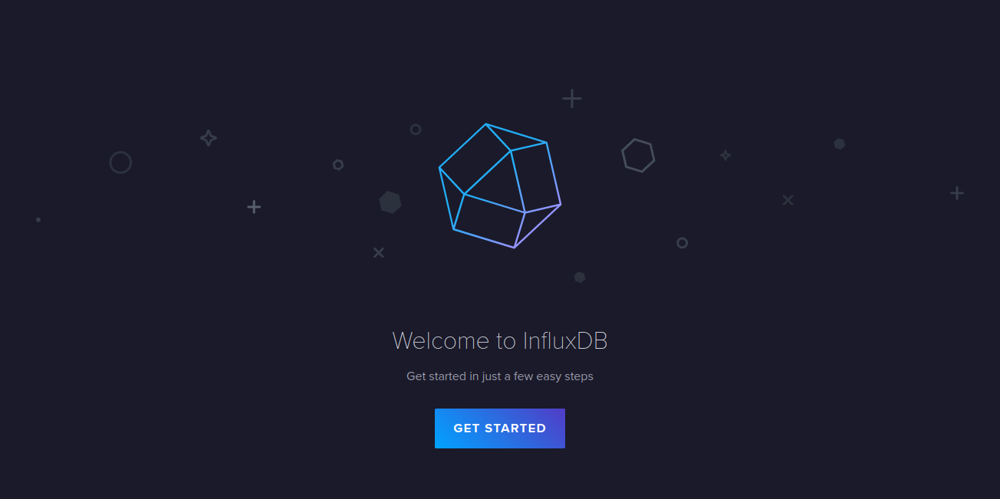
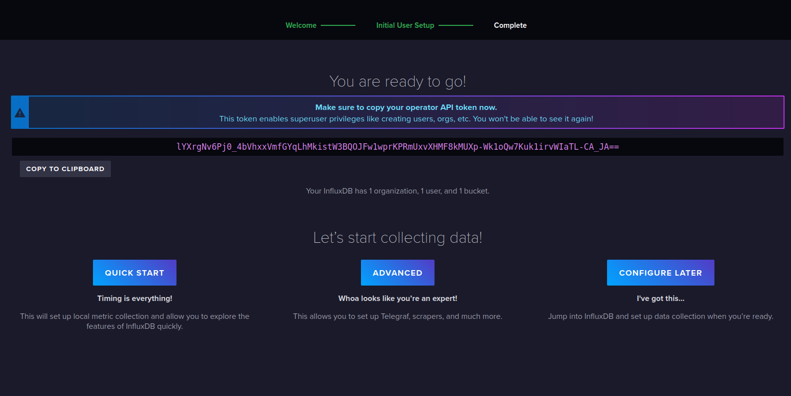
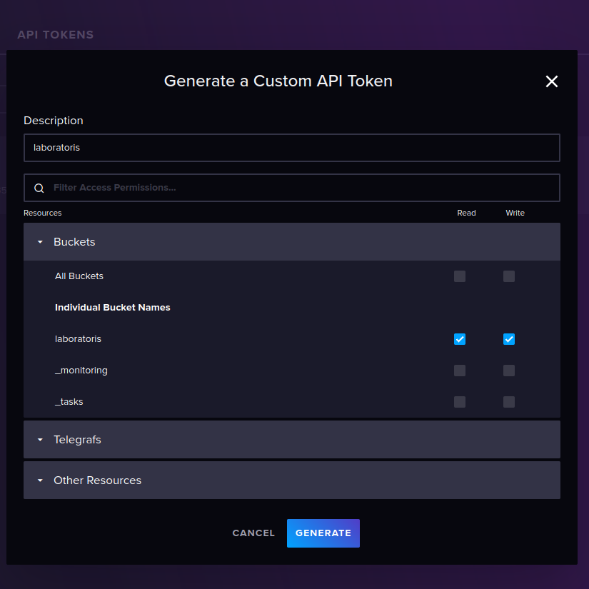
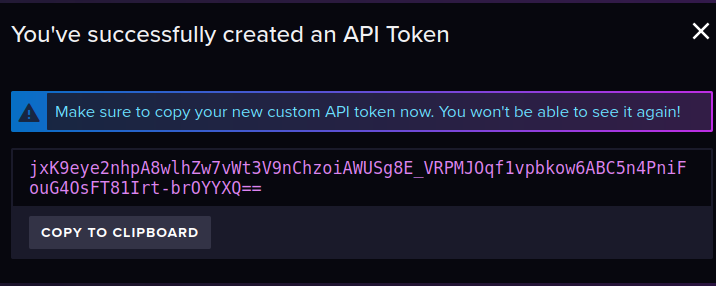
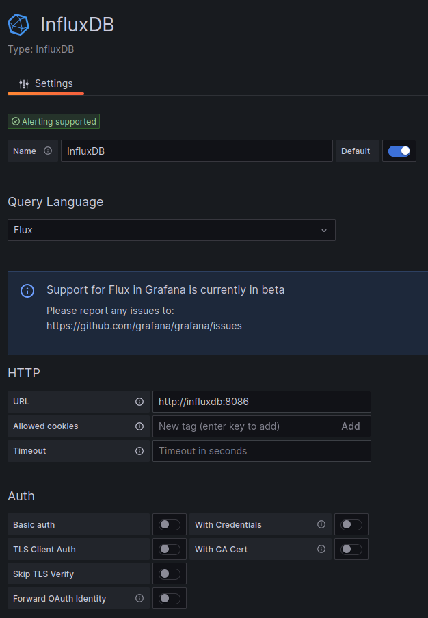
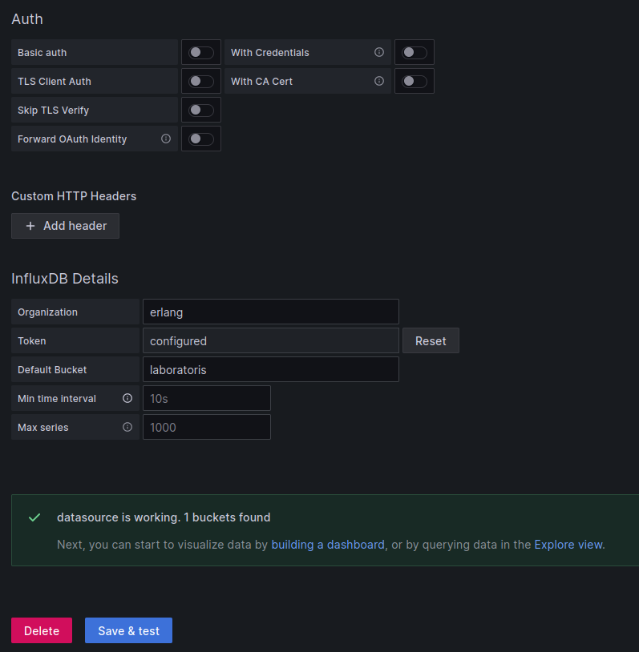

# TIG Stack - Introduction to GRAFANA

    

## 0. Build the database

On a first step it is needed to deploy and configure InfluxDB
Docker volume will be used to keep data permanent. Create docker-compose.yml file as shown below:
  
        version: '3.8'
        services:
          influxdb:
             image: influxdb:latest
             container_name: influxdb
             ports:
               - "8083:8083"
               - "8086:8086"
               - "8090:8090"
             env_file:
              - influx/influxv2.env
             volumes:
               - influxdb_data:/var/lib/influxdb:rw
        volumes:
          influxdb_data:

Config file will need to be updated once configuration done

        DOCKER_INFLUXDB_INIT_USERNAME="admin"
        DOCKER_INFLUXDB_INIT_PASSWORD="admin1234"
        DOCKER_INFLUXDB_INIT_ORG="erlang"
        DOCKER_INFLUXDB_INIT_BUCKET="laboratoris"
        DOCKER_INFLUXDB_INIT_RETENTION="15d"
        DOCKER_INFLUXDB_INIT_ADMIN_TOKEN="_44OFBxECX4uycpBxmrkmBduwN-_a3BGQgBNyqA730trk3s6QKepFEDajsKmyWiuzzMu_c0pBSmxmCW8SqDc-A=="

On first startup, database GUI will be available

        sudo docker-compose up

        http://localhost:8086

    

## 1. Setup bucket

* User: admin
* Pass: admin1234
* Organization: erlang
* Bucket: laboratoris
* Admin API token

    

* RW API tocket for the organization

    

    

## 2. Build Telegraf

Create a Docker file to build Telegraf. Selected this way as per avoid one additional Docker volume for the config file.

        # pull official base image 
        FROM telegraf:latest
        
        COPY ./telegraf.conf /etc/telegraf/telegraf.conf

Config has to look as follows, as we've added syslog forwarding to the one generated using InfluxDB.

        [agent]
           interval = "10s"
           round_interval = true
           metric_batch_size = 1000
           metric_buffer_limit = 10000
           collection_jitter = "0s"
           flush_interval = "10s"
           flush_jitter = "0s"
           precision = ""
           hostname = "telegraf"
           omit_hostname = false
           
         [[outputs.influxdb_v2]]
          urls = ["http://influxdb:8086"]
          token = "$INFLUX_TOKEN"
          organization = "erlang"
          bucket = "laboratoris"

         [[inputs.syslog]]
           server = "udp://:6514"

Create environment file to pass the InfluxDB token to Telegraf

        INFLUX_TOKEN="jxK9eye2nhpA8wlhZw7vWt3V9nChzoiAWUSg8E_VRPMJOqf1vpbkow6ABC5n4PniFouG4OsFT81Irt-brOYYXQ=="

Update docker-compose.yml file:

        version: '3.8'
        services:
          influxdb:
             image: influxdb:latest
             container_name: influxdb
             ports:
               - "8083:8083"
               - "8086:8086"
               - "8090:8090"
             env_file:
              - influx/influxv2.env
             volumes:
               - influxdb_data:/var/lib/influxdb:rw
          telegraf:
             build:
               context: ./telegraf/
               dockerfile: Dockerfile
             user: "0"
             container_name: telegraf
             env_file:
              - telegraf/telegraf.env
             ports:
               - "6514:6514/udp"
             links:
               - influxdb
        volumes:
          influxdb_data:

On startup Telegraf will load config and listen of 8086/tcp for incoming syslog messages.
Those syslog's will be forwarded to the InfluxDB as time-based storage.

        sudo docker-compose up

        telegraf  | 2023-06-25T09:56:44Z I! Loading config: /etc/telegraf/telegraf.conf
        telegraf  | 2023-06-25T09:56:44Z I! Starting Telegraf 1.27.1
        telegraf  | 2023-06-25T09:56:44Z I! Available plugins: 237 inputs, 9 aggregators, 28 processors, 23 parsers, 59 outputs, 4 secret-stores
        telegraf  | 2023-06-25T09:56:44Z I! Loaded inputs: syslog
        telegraf  | 2023-06-25T09:56:44Z I! Loaded aggregators: 
        telegraf  | 2023-06-25T09:56:44Z I! Loaded processors: 
        telegraf  | 2023-06-25T09:56:44Z I! Loaded secretstores: 
        telegraf  | 2023-06-25T09:56:44Z I! Loaded outputs: influxdb_v2
        telegraf  | 2023-06-25T09:56:44Z I! Tags enabled: host=telegraf
        telegraf  | 2023-06-25T09:56:44Z I! [agent] Config: Interval:10s, Quiet:false, Hostname:"telegraf", Flush Interval:10s

        11565af3bff8   tig-telegraf             "/entrypoint.sh tele…"   52 minutes ago      Up 50 minutes   8092/udp, 0.0.0.0:6514->6514/udp, :::6514->6514/udp, 8125/udp, 8094/tcp                                                           telegraf
        78bb359b60be   influxdb:latest          "/entrypoint.sh infl…"   About an hour ago   Up 50 minutes   0.0.0.0:8083->8083/tcp, :::8083->8083/tcp, 0.0.0.0:8086->8086/tcp, :::8086->8086/tcp, 0.0.0.0:8090->8090/tcp, :::8090->8090/tcp   influxdb

## 2. Build Grafana

A second Docker volume will be created to store configuration and data.
Update docker-compose.yml file as shown below:

        version: '3.8'
        services:
          influxdb:
             image: influxdb:latest
             container_name: influxdb
             ports:
               - "8083:8083"
               - "8086:8086"
               - "8090:8090"
             env_file:
              - influx/influxv2.env
             volumes:
               - influxdb_data:/var/lib/influxdb:rw
          telegraf:
             build:
               context: ./telegraf/
               dockerfile: Dockerfile
             user: "0"
             container_name: telegraf
             env_file:
              - telegraf/telegraf.env
             ports:
               - "6514:6514/udp"
             links:
               - influxdb
          grafana:
             image: grafana/grafana:latest
             container_name: grafana
             depends_on:
               - influxdb
             links:
               - influxdb
             ports:
               - "3000:3000"
             volumes:
               - grafana_data:/var/lib/grafana:rw
        volumes:
          influxdb_data:
          grafana_data:

On first startup, database GUI will be available

        sudo docker-compose up

        http://localhost:3000

Datasource configuration in Gragafa.

    

    

